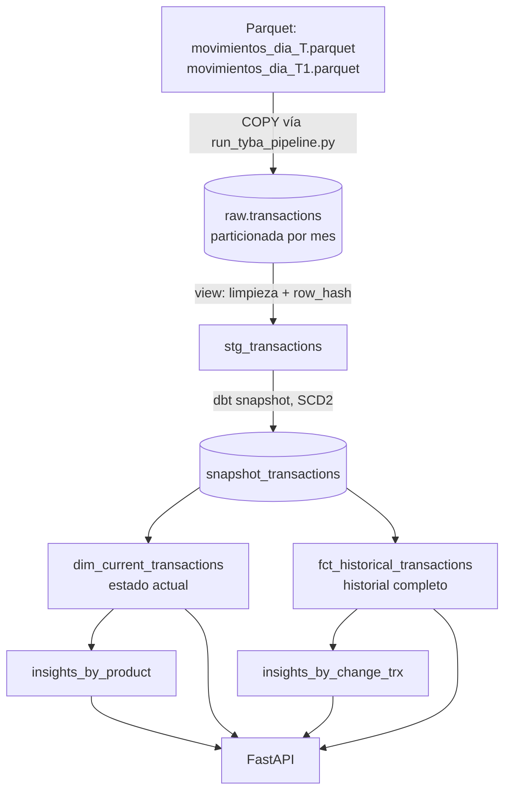

# Pipeline de Movimientos Financieros — Tyba -  (Python, DBT, Postgres, FastAPI)

Pipeline de ingeniería de datos de extremo a extremo que ingiere cortes diarios
de movimientos financieros (parquet), detecta su evolución día a día (nuevos,
corregidos, eliminados, sin cambios) manteniendo trazabilidad completa, y
expone el resultado consultable vía Postgres y una API.

## Arquitectura

Arquitectura tipo medallion (bronze/silver/gold) con la capa gold modelada como data mart (fact/dim), y una capa silver historizada vía SCD2 para mantener trazabilidad completa de los cambios entre cortes

### Capas / Esquemas Postgres

| Capa/Esquema | Objeto/Tablas | Qué hace |
|---|---|---|
| raw | `raw.transactions` (Postgres, indexada y particionada por mes) | Datos crudos tal cual llegan del parquet, cargados vía `COPY`. Append-only: nunca se sobreescribe ni se borra — es la fuente de verdad para auditar o reprocesar. |
| staging | `stg_transactions` (view) | Tipado, limpieza de datos sucios, deduplicación intra-corte, y cálculo de `row_hash` (hash de los campos de negocio) para detectar cambios. |
| snapshots | `snapshot_transactions` (SCD2 -Slowly Change Dimension) | Compara cada corte contra el anterior usando `row_hash` y resuelve automáticamente **nuevo** / **corregido** / **eliminado** / **sin cambios**, sin perder trazabilidad (`dbt_valid_from`, `dbt_valid_to`, `dbt_is_deleted`). **Resuelve los cortes diarios y movimientos de los clientes** |
| marts | `dim_current_transactions`, `fct_historical_transactions`, `insights_*` | Estado actual, historial auditable, y agregaciones de negocio listas para consumo. IMPORTANTE: Tabla para Dashboards, API, negocio **dim_current_transactions** |
| API | FastAPI | Expone los marts de solo lectura. |

| Diagrama



### Decisiones clave

- **Postgres sobre DuckDB**: el volumen esperado (millones de filas, crecimiento diario) necesita concurrencia real, particionamiento e índices — no solo lectura analítica de un archivo local.
- **dbt snapshot (SCD2) sobre lógica custom en Python**: la detección de nuevo/corregido/eliminado es una regla de negocio declarativa; dbt la resuelve de forma probada y auditable en vez de reinventar control de versiones a mano.
- **Loader separado de dbt**: Python solo mueve bytes (parquet → raw) vía `COPY FROM STDIN` (Carga masiva, no `INSERT` fila a fila — crítico a escala). Toda la transformación vive en SQL/dbt, versionada como código.
- **Particionamiento por `_loaded_at`** (no por `date` del negocio): ese campo llega como texto sucio del parquet; `_loaded_at` lo controla el loader y siempre es válido.
- **`row_hash`** en vez de comparar campo por campo: barato de calcular y de comparar a escala.
- **Sin Airflow**: el alcance pedido (`docker compose up --build`, sin scheduling explícito) no lo justifica. La orquestación mínima vive en `entrypoint.sh` + `run_pipeline.py`: cargar corte → `dbt snapshot`, por cada archivo nuevo, en orden.

## Conceptos clave: SCD2 y particionamiento

### ¿Qué es SCD2 y por qué lo usamos?

**SCD2 (Slowly Changing Dimension Type 2)** es un patrón de modelado de datos
para cuando un registro puede cambiar a lo largo del tiempo y **necesitas
conservar el historial de esos cambios**, no solo el valor más reciente. En
vez de hacer `UPDATE` sobre la fila existente (lo que destruiría el valor
anterior), cada cambio genera una **fila nueva**, y las filas viejas se
"cierran" marcando hasta cuándo estuvieron vigentes.

Concretamente, cada fila de `snapshot_transactions` tiene:

| Columna | Significado |
|---|---|
| `dbt_valid_from` | Desde cuándo esta versión del registro es la vigente |
| `dbt_valid_to` | Hasta cuándo lo fue (`NULL` si sigue vigente hoy) |
| `dbt_is_deleted` | `true` si el `id` desapareció de un corte posterior |

Así, para un mismo `id` puede haber varias filas en el snapshot — una por
cada versión que tuvo — y en todo momento hay **como máximo una** con
`dbt_valid_to IS NULL` (la vigente). Esto resuelve exactamente los cuatro
escenarios del enunciado:

- **Nuevo**: `id` no existía → se inserta su primera versión.
- **Corregido**: cambia el `row_hash` → se cierra la versión anterior
  (`dbt_valid_to` = ahora) y se abre una nueva (`dbt_valid_from` = ahora).
- **Eliminado**: el `id` no aparece en el corte más reciente → se cierra su
  versión vigente y se marca `dbt_is_deleted = true`.
- **Sin cambios**: mismo `row_hash` → dbt no toca la fila.

La ventaja frente a hacerlo a mano (por ejemplo, con `UPDATE`/`DELETE` en
Python) es que dbt snapshot ya resuelve de forma probada toda la lógica de
comparación, cierre de versiones y detección de eliminados — nosotros solo
le decimos **qué columna define un cambio** (`check_cols=['row_hash']`).

### ¿Qué es el particionamiento y por qué lo usamos?

**Particionar** una tabla en Postgres significa dividirla físicamente en
varias tablas más pequeñas ("particiones"), aunque desde SQL se siga viendo
y consultando como una sola tabla (`raw.transactions`). Cada partición
guarda solo las filas que caen dentro de un rango definido — en nuestro
caso, un rango de fechas por mes.

Con millones de filas creciendo día a día, esto trae dos beneficios
concretos:

- **Pruning automático**: si una consulta filtra por fecha (ej. "dame los
  movimientos de octubre"), Postgres ni siquiera abre las particiones de
  otros meses — escanea solo la partición relevante, en vez de la tabla
  completa.
- **Mantenimiento barato**: si algún día necesitas archivar o borrar datos
  viejos, puedes hacer `DROP` de una partición completa (instantáneo) en
  vez de un `DELETE` masivo (lento y que genera mucho *bloat* en Postgres).

**Cómo se crean las particiones aquí**: `raw.transactions` está particionada
por rango sobre `_loaded_at` (el momento en que el loader insertó la fila,
no la fecha de negocio del movimiento — ver la sección de decisiones clave).
El macro `create_current_month_partition()` corre en cada invocación del
pipeline y crea, si no existe, la partición del mes en curso según la fecha
real del contenedor (`now()`). Así, con el tiempo, la tabla queda dividida en
`transactions_2026_09`, `transactions_2026_10`, etc. — cada una con los datos
cargados ese mes — más una partición `transactions_default` que actúa de
respaldo por si alguna fila llegara fuera de cualquier rango ya creado.

Los índices (`id`, `type+fund`) se definen **una sola vez** sobre la tabla
padre y Postgres los propaga automáticamente a cada partición nueva, sin
que haya que recrearlos manualmente cada mes.

## Cómo correrlo

**Requisito único**: Docker y Docker Compose instalados.

1. Coloca los archivos de entrada en `data/raw/`:
   ```
   data/raw/movimientos_dia_T.parquet
   data/raw/movimientos_dia_T1.parquet
   ```

2. Levanta todo:
   ```bash
   docker compose up --build
   ```

Eso es todo — sin configuración adicional. Ya se ejecuta el **entrypoint.sh** Internamente, en orden:

```
1. Postgres levanta y expone healthcheck
2. Servicio "pipeline" espera a que Postgres esté listo
3. dbt run-operation create_raw_schema   → crea raw.transactions (particionada) + tabla de control
4. run_pipeline.py                       → por cada parquet NUEVO (orden alfabético = cronológico):
                                              a. lo carga a raw.transactions (COPY)
                                              b. corre `dbt snapshot` inmediatamente
5. dbt run                               → reconstruye staging + marts
6. dbt test                              → valida calidad de datos
7. Servicio "api" arranca en :8000, una vez el pipeline terminó exitosamente
```

### Reprocesar / agregar un nuevo corte

El pipeline es idempotente: si vuelves a correr `docker compose up --build`
con los mismos archivos, `run_pipeline.py` detecta (vía `raw._processed_files`)
que ya fueron cargados y no hace nada. Para simular un nuevo día, agrega un
archivo `movimientos_dia_T2.parquet` a `data/raw/` y vuelve a correr.

### API

Con el stack arriba, disponible en `http://localhost:8000`:

| Endpoint | Descripción |
|---|---|
| `GET /health` | Chequeo de salud |
| `GET /transactions` | Transactions|
| `GET /transactions_by_client/{id_cliente}` | Un movimiento vigente por ID cliente |
| `GET files_processed` | Archivos proceesados|

## Estructura del repo

```
repo/
├── data/
│   ├── raw/                 ← parquet de entrada (montado como volumen)
│   └── output/
├── dbt_tyba/                ← proyecto dbt
│   ├── dbt_project.yml
│   ├── profiles.yml
│   ├── macros/
│   │   ├── create_raw_schema.sql      ← DDL de raw.transactions (particionada)
│   │   └── generate_schema_name.sql   ← esquemas limpios (staging/marts/snapshots)
│   ├── models/
│   │   ├── staging/         ← stg_transactions + sources.yml + tests
│   │   └── marts/           ← dim_current_transactions, fct_historical_transactions, insights_*
│   ├── snapshots/           ← snapshot_transactions.sql (SCD2)
│   └── tests/                ← tests singulares de calidad
├── src/
│   ├── loader.py             ← carga eficiente (COPY) de parquet a Postgres
│   ├── run_pipeline.py       ← orquestador: por cada corte, carga + snapshot
│   └── api.py                ← FastAPI de solo lectura sobre los marts
├── Dockerfile
├── docker-compose.yml
├── entrypoint.sh
├── requirements.txt
└── README.md
```

## Calidad de datos: decisiones y supuestos

- **`id` nulo o vacío**: se descarta en `stg_transactions`. No es posible rastrear
  un registro sin identificador, y mantenerlo rompería la lógica de SCD2.
- **`amount` no numérico**: se castea de forma segura y queda `NULL` en vez de
  descartar la fila completa — se prioriza no perder trazabilidad del registro.
- **Strings vacíos** (`""`) se normalizan a `NULL` en todos los campos de texto.
- **`type` en minúsculas**: se normaliza para evitar duplicar categorías por
  diferencias de mayúsculas/minúsculas (`Entrada` vs `entrada`).
- **Duplicados dentro del mismo corte** (mismo `id` repetido en un solo
  archivo): se conserva la última fila cargada. Es una regla arbitraria pero
  explícita — no hay forma de saber cuál es "la correcta" sin contexto de
  negocio adicional.
- **Todo se carga primero como `TEXT`** en `raw.transactions`: el loader nunca
  falla por un dato sucio; el tipado real (y las decisiones de qué hacer con
  datos inválidos) vive en dbt, donde queda documentado y testeado.

## Tests de calidad (`dbt test`)

- `stg_transactions`: `id` not_null; `type` en valores esperados (warn);
  `amount` not_null (warn); `row_hash` not_null.
- `dim_current_transactions`: `id` unique + not_null.
- `fct_historical_transactions`: `id` not_null; `event_type` en
  `['new', 'corrected', 'deleted']`.
- Test singular: `amount` no debería ser `0` cuando `type` está definido
  (posible dato sucio a revisar).

## Escala

- `COPY FROM STDIN` en vez de `INSERT` fila a fila para la carga.
- `raw.transactions` particionada por rango mensual sobre `_loaded_at`, con
  índices en `id` y `(type, fund)` propagados automáticamente a cada partición.
- `row_hash` evita comparar campo por campo en la detección de cambios.
- `fct_historical_transactions` es incremental (no se reconstruye completa
  en cada corrida), ya que es la tabla que crece sin límite con cada corte.

## Limitaciones conocidas

- Si el contenedor corre exactamente en el cruce de medianoche de fin de mes,
  es teóricamente posible que algunas filas caigan en la partición `default`
  antes de que se cree la del nuevo mes. Para el alcance de esta prueba no es
  un riesgo real; en producción se resolvería con `pg_partman` u otro
  mecanismo de creación de particiones anticipada.
- La orquestación (`entrypoint.sh` + `run_pipeline.py`) es suficiente para
  correr manualmente o con `docker compose up`, pero no incluye scheduling.
  Para producción con corridas diarias automáticas, se añadiría un scheduler
  (cron dentro del contenedor, o un orquestador como Airflow) por encima de
  este mismo pipeline — no se incluyó por no ser parte del alcance pedido.

## EDA e Insights

En esta parte vamos a realizar una explicacion con un cliente paso a paso
y tambien vamos a responder preguntas del negocio en el notebook: 

**[Analisis e Insighs ](/app//EDA.ipynb)**

Preguntas:

- Como se mueve el Pipeline se tomo de ejemplo el id_cliente: CLI002977
- Como se ve el negocio hoy?
- Como evolucionaron los datos de un dia a otro?
- Volumen de transacciones por producto y fondo
- Hacia donde se mueve el dinero, y cuando?


